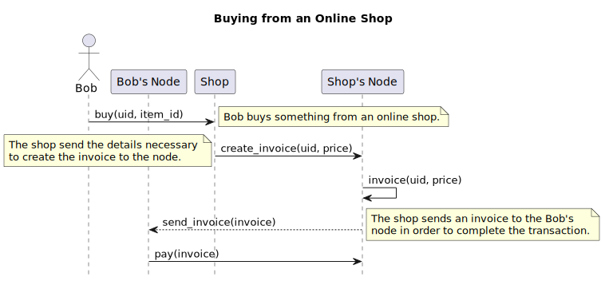

# Lightning auto-pay -  _Document de vision_

**Organisation:** Cedille, École de Technologie Supérieure

Ce document de vision decrit un protocole pour envoyer une facture à un node lightning qui pourra être automatiquement accepter. 

## Table des matières

- [1. Résumé](#1-overview)
  * [1.1 Objectifs](#11-objective)
  * [1.2 Étendu](#12-scope)
  * [1.3 Definitions and acronymes](#13-definitions-and-acronyms)
- [2. Position du produit](#2-product-positions)
  * [2.1 TO-DO](#22-product-statement)
- [3. Utilisateurs et partis concernés](#3-users-and-stakeholders)
  * [3.1 Liste des partis concernés](#31-stakeholders-summary)
  * [3.2 Liste des utilisateurs](#32-users-summary)
  * [3.3 L’environnement utilisateur](#33-users-environment)
- [4. Les besoins des utilisateurs principaux](#4-main-users-and-stakeholders-needs)
- [4. Survol du produit](#4-product-overview)
  * [4.1 Situation du produit](#41-product-context)
  * [4.2 Principaux intérets](#42-main-benefits)
  * [4.3 Hypotheses et dependences](#43-hypotheses-and-dependencies)
  * [4.4 Licenciement](#44-licensing)
  * [4.5 Caractéristiques du produit](#45-product-characteristics)
  * [5. Contraintes](#5-constraints)
  * [6. Attributs qualitatifs](#6-quality-attributes)
- [7. Exigences autres](#7-other-requirements)
  * [7.1 Standards and Normes](#71-standards-and-norms)
  * [7.2 Exigences du système](#72-system-requirements)
  * [7.3 Exigences de la documentation](#73-documentation-requirements)

## 1. Résumé

Le Lightning Network est un réseau décentralisé de noeud Bitcoin et Lightning qui permet à ses utilisateurs de faire des transactions instantanée à faible coût.

Présentement, le protocole n'est pas particulièrement adapté à servir certain modèles de commerce sans avoir à compremettre de la confiance.

Par example, admettons qu'on a une platforme de streaming où les utilisateurs paient des micro-transactions pour voir des films. L'utilisateur peut soit déposer des fonds au préalable sur la plateforme et donc mettre en jeu plus d'argent que nécessaire où il peut payer de son portefeuille directement pour chaque films ce qui est pénible.

Ce document de vision va identifier les différents besoins et critères qui sont nécessaire afin de trouver une solution au problème cité dans le paragraphe précedent. Cette solution sera conçue et réalisée par le club CÉDILLE.

### 1.1 Objectif

L'objectif est de créer un protocole et une implémentation de celui-ci qui permettrait d'envoyer une requête de paiement à un nœud.

### 1.2 L'étendu

### 1.3 Definitions et acronymes

**tableau 1.3.1: Définitions et acronymes**

| **ÉTS** | École de Technologie Supérieure |
| --- | --- |
| **Noeud**	| Un ordinateur qui participe au réseau Lightning |
| **Lightning** | Un protocole qui dicte un réseau de paiement tirant profit de la blockchain |
| **Blockchain** | Un registre décentralisé de transactions |

## 2. Situation du produit

### 2.1 Le problème

**tableau 2.1.1: Le problème**

|Statement||
| --- | --- |
| | |

## 3. Utilisateurs et partis concernés

### 3.1 Partis concernés

Les parties concernés sont les individus ou entités intéressés ou touché par la réalisation du projet.

**tableau 3.1.1: Liste des partis concernés**

| **Nom** | **Description** | **Responsabilités** |
| --- | --- | --- |
| **S1** CEDILLE | Club de logiciel open source à l'École de Technologie Supérieure | Conception et réalisation du projet |
| **S2** Communauté Open-Source | Les individus qui ne sont pas membre du club CÉDILLE | Proposer des changements aux projet |
| **S3** Opérateur de noeud Lightning | Les individus qui opèrent des noeuds Lightning | Router les paiements |

### 3.2 Les utilisateurs

Les utilisateurs sont tous les individus où entités qui utiliseront ce produit.

**tableau 3.2.1 : Liste des utlisateurs**

| **Nom** | **Description** | **Responsabilités** |
| --- | --- | --- |
| **U1** Utilisateurs | Tous les utilisateurs du Lightning Network | - |

### 3.3 Environnement de l'utilisateur

TO-DO

## 4. Les besoins des utilisateurs principaux

**tableau 3.4.1: Les utilisateurs principaux et leurs besoins**

| **Besoin** | **Priorité** | **Situation actuelle**| **Finalité** |
| --- | --- | --- | --- |
| **N05** – ... | - | N/A |  |

## 4. Un survol du produit

### 4.1 La situation du produit

**Figure 4.1.1:** Situation du produit

### 4.2 Les principaux avantages

**tableau 4.2.1: Caractéristiques correspondants aux besoins de l'utilisateur**

| **Besoin de l'utilisateur** | **Caractéristiques correspondants** |
| --- | --- |
| **N01** – .. | - |

### 4.3 Hypothèses et dépendances

### 4.4 Licenciement 

La licence du projet qu'on va fork.

### 4.5 Caractéristiques du produit

**tableauau 5.1 : Caracteristiques du produit**

| **ID** | **Description** | **Priorité** |
| --- | --- | --- |
| CAR15 | - ||

### 5. Contraintes

**tableau 5.1 :Contraintes**

| **ID** | **Contraintes** | **Description** |
| --- | --- | --- |
| | |

### 6. Attributs qualitatifs

**Interoperabilité**

AQ1 - La solution doit être compatible avec BOLT.

**Performance**

AQ2 – L'implémentation de la fonctionnalité ne devrait faire aucune différence pour un noeud.

**Habilité à modifier**

AQ3 – 

**Sécurité**

AQ4 – 

**Utilisation**

AQ6 – 

**Évolutivité**

AQ7 –

## 7. Autres besoins

### 7.1 Standards and Normes

- BOLT

### 7.2 Exigences du système

Le déploiement doit fonctionner dans un environnement containérisé. Docker-compose et Kubernetes devrait être des options disponible.

### 7.3 Exigences de la documentation

- Documenter le protocole
